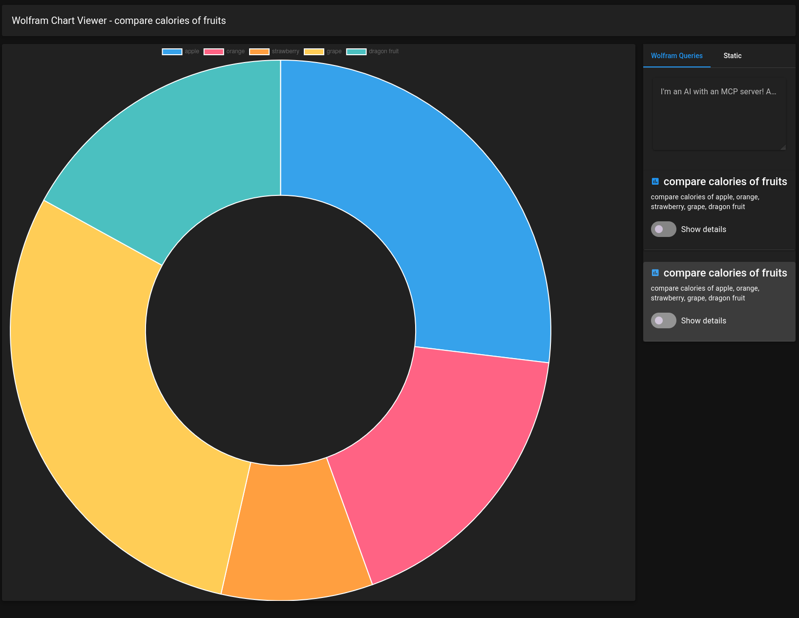
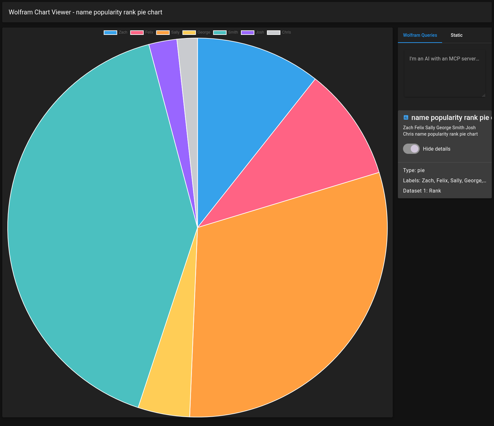
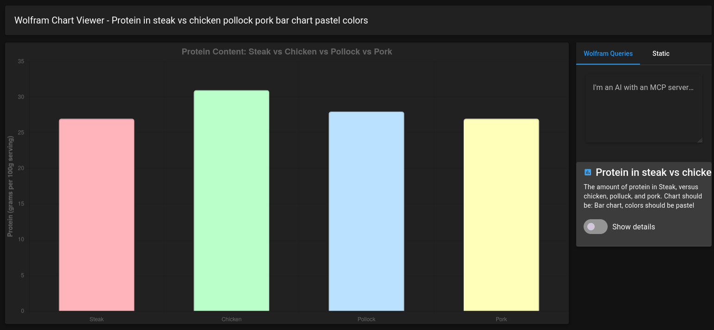
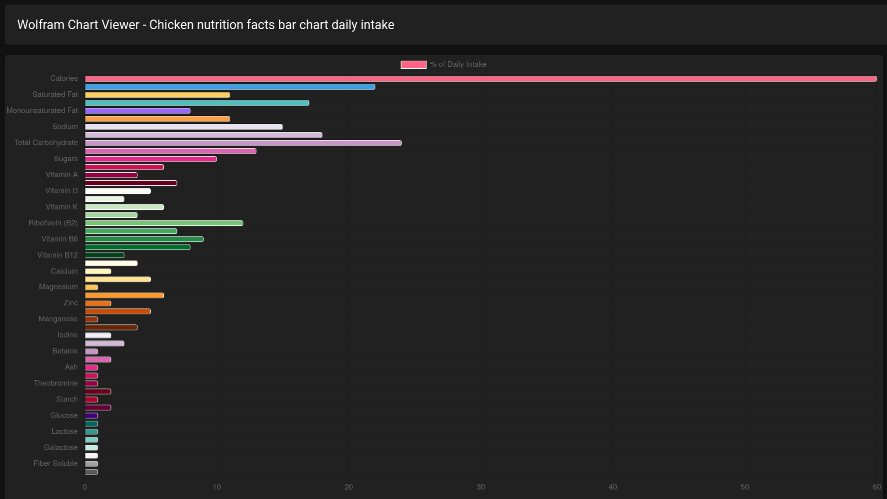
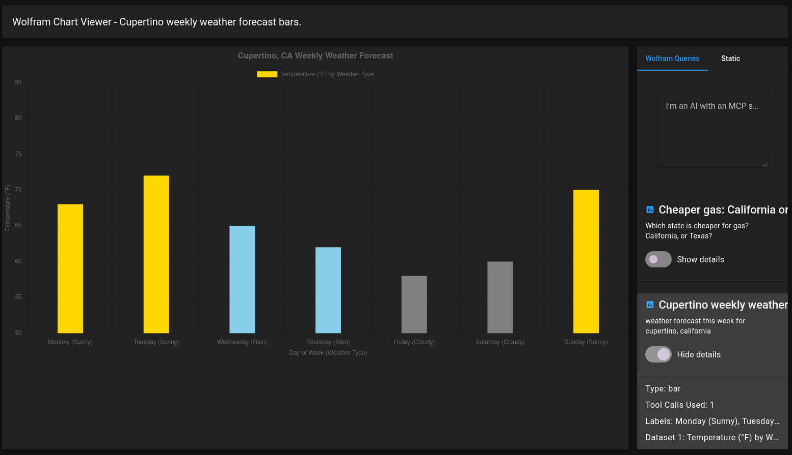

# Wolfram Chart viewer

A chart application designed to make use of the [Wolfram Alpha](https://wolframalpha.com) MCP server and [Chart.js](https://www.chartjs.org/), to display custom graphs!

It makes use of the following under the hood to bring it to life:

- Bun
- Vue.js
- Pinia (data state management)
- Vuetify
- Langchain
- Nuxt
- Vite
- Zod

# Setup

First, ensure you have an openrouter api key! If not, grab one over at https://openrouter.ai . Afterwards, return here and paste that into [`.env`](./.env)

Next, install everything via bun:

```bash
# Install...
bun i

# Then run!
bun --bun dev

# < Now Listening to http://localhost:3000 ... >
```

> If you don't want to use openrouter, there are static examples of charts on the second tab of the page.

# Protips for running

## Be specific with your prompts

What's helped me is to prompt what kind of chart you'd like, optionally colors, and the types of values the chart needs needs to plot down (e.g "value should be USD")

It'll do it's best, but makes mistakes regardless!

## Test the prompt box without actually triggering the LLM

Simply inserting `!mock` in the box allows to test server calls without calling an LLM or using an API key.

# Dream upgrades

Possible routes that could be taken if this was worked on more:

- [x] sub-agent delegation on queries
- [ ] plugins: gather data from other MCP sources & tools
- [ ] localStorage support to store queries, chart data and history
- [x] "tools called" section in the metadata
- [ ] data verification (is this a correct shape, even though the model tried?)
- [ ] custom theming

# Starter queries

```
compare the amount of protein in: Steak, chicken, turkey, polluck (please make a bar chart)
```

```
calories of apple, orange, strawberry, grape, dragon fruit (make it a donut graph)
```

```
How expensive is gas between Toronto and Honolulu Hawaii?
```

```
What is the value of gold, versus the value of bitcoin? (provide actual value in USD and create a pie-chart)
```

```
use "name {name}" to query the popularity of the following names: Zach, Felix, Sally, George, Smith, Josh, Chris. Make it a pie chart. Datapoints should be "rank"
```

```
box office proffit of toy story 1 versus toy story 2
```

```
(skip wolfram) Make me a pie chart that has the following values: 3, 50, 25, 22
```

```
A bubble graph of the birth, death, and presidency of the two presidents: george washington, abraham lincoln
```

```
"polar area chart" for the value of gold, silver, nickle, copper, diamond. Value should be worth in USD. Colors of the bars should represent the color of each item.
```

```
pie chart that has a value of 75% labeled pacman, and a dark-blue remainder with the label "ghost"
```

```
Display the entire nutrition facts for "chicken". It must be a bar chart, should have color. Measurement should be % of daily intake
```

# Known Bugs

- GLM5.2 will sometimes make weird chart data, it confuses chart.js if that happens it can cause the app to crash.

# Gallery







