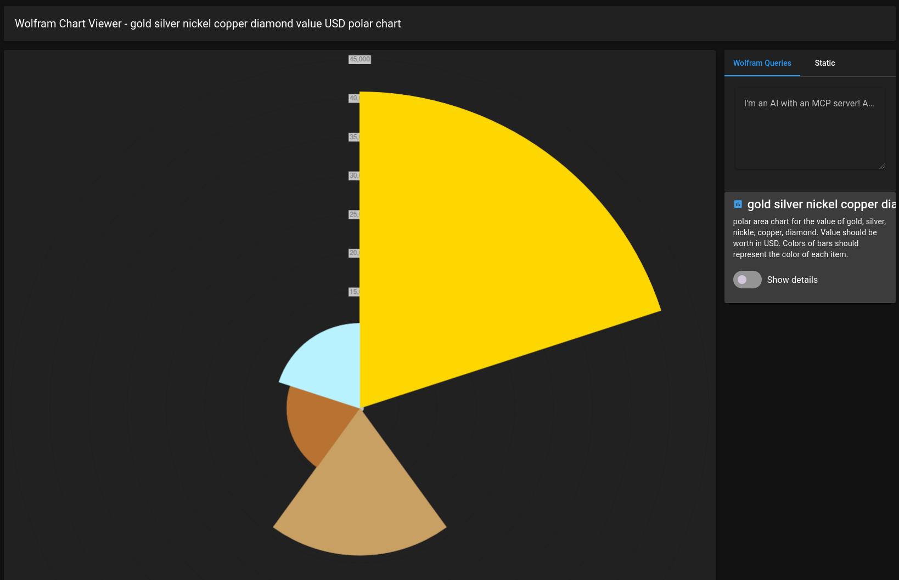

# Wolfram Chart viewer

A chart application designed to make use of the [Wolfram Alpha](https://wolframalpha.com) MCP server and [Chart.js](https://www.chartjs.org/), to display custom graphs!

It makes use of the following under the hood to bring it to life:

- Bun
- Vue.js
- Pinia (data state management)
- Vuetify
- Langchain
- Nuxt
- Vite
- Zod

# Setup

First, ensure you have an openrouter api key! If not, grab one over at https://openrouter.ai . Afterwards, return here and paste that into [`.env`](./.env)

Next, install everything via bun:

```bash
# Install...
bun i

# Then run!
bun --bun dev

# < Now Listening to http://localhost:3000 ... >
```

> If you don't want to use openrouter, there are static examples of charts on the second tab of the page.

# Protips for running

## Be specific with your prompts

Because GLM5.2 consumes a large zod type, it isn't going to know all the time what the best shape will be, even though we're specific on it's structure.

What's helped me is to tell it what kind of chart you'd like, optionally colors, and the types of values it needs to plot down (e.g "value should be USD")

It'll do it's best, but makes mistakes regardless!

## providerStrategy

This is a special inferrence system that transforms any data the model gets into a usable format. In this app's case, it's using a very large (and auto-generated) zod file to tell GLM5.2 how to build a chart.

Not all models on openrouter have this. GLM5.2 I've found works great with this, but it's also a token consumer if you aren't careful!

This is just a preface here to mention if you change the model, it might not work as expected! In an alternate reality this could be mitigated by first grabbing the data, then having a sub-agent transform the data instead of it being in a single step.

# Dream upgrades

Possible routes that could be taken if this was worked on more:

- sub-agent delegation on queries
- prompt-injection protection (more necessary for database-like projects)
- plugins: gather data from other MCP sources & tools
- localStorage support to store queries & chart data
- "tools called" section in the metadata
- data verification (is this a correct shape, even though the model tried?)
- custom theming

# Known Bugs

- Sometimes a finished query doesn't render right away - click on another graph, then click back onto it!
- GLM5.2 will sometimes make weird chart data, it confuses chart.js if that happens it can cause the app to crash.

# Gallery




